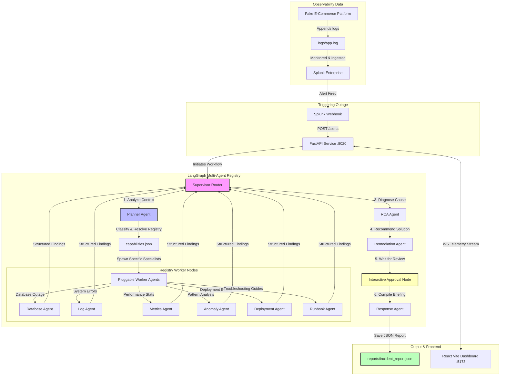

# OpsPilot AI — Autonomous Incident Investigation & Response Platform

[](https://youtu.be/bYop9qhEUvk)

OpsPilot AI is an adaptive, domain-agnostic agentic incident investigation and response platform. By replacing rigid, static pipelines with a planner-driven registry model, OpsPilot AI dynamically diagnoses systems outages, correlates observability data, recommends actions, and executes remediation with operator oversight.

Built on **LangGraph**, **FastAPI**, **React (Vite)**, and **Splunk MCP (Model Context Protocol)**, OpsPilot AI acts as a virtual elite Site Reliability Engineer (SRE) that responds to alerts, analyzes logs/metrics, and reduces Mean Time to Resolution (MTTR) to seconds.

---

## 📺 Hackathon Demo Video

Check out the full workflow, dynamic agent spawning, and real-time observability stream in action:
* **Demo Video Link:** [https://youtu.be/bYop9qhEUvk](https://youtu.be/bYop9qhEUvk)

---

## 🏗️ Architecture Diagram



---

## 📁 Directory Structure

```text
SplunkAgenticOps/
├── .venv/                      # Python virtual environment (managed by uv)
├── .env                        # Local environment credentials & keys
├── pyproject.toml              # Project dependencies & python metadata
├── verify_opspilot.py          # E2E pipeline verification script
├── LICENSE                     # MIT Open Source License
├── runbooks/                   # Local Operations Knowledge base
│   ├── runbook_db.py           # Local runbook search engine
│   ├── database_errors.md      # DB troubleshooting runbook
│   ├── redis_errors.md         # Redis cache runbook
│   └── payment_errors.md       # Payment gateway runbook
├── api/                        # FastAPI Web API layer
│   ├── main.py                 # FastAPI service endpoints
│   ├── mcp_client.py           # Reusable Splunk MCP stdio wrapper
│   └── websocket_manager.py    # WebSocket client manager
├── agents/                     # LangGraph Multi-Agent Orchestrator
│   ├── state.py                # Graph state definitions
│   ├── models.py               # Pydantic structured output schemas
│   ├── registry.py             # Dynamic worker agent registry
│   ├── nodes.py                # Individual Agent logic (Gemini)
│   ├── planner_agent.py        # Planning and alert classification agent
│   ├── graph.py                # Dynamic LangGraph compilation
│   └── domain/                 # Domain specialist agents
│       ├── database_agent.py
│       ├── network_agent.py
│       ├── security_agent.py
│       ├── kubernetes_agent.py
│       ├── application_agent.py
│       └── infrastructure_agent.py
├── generator/
│   └── log_generator.py        # Mock e-commerce log generator
├── logs/
│   ├── app.log                 # Continuously generated logs
│   └── deployment.log          # Correlated deployment events
└── frontend/                   # React + Vite frontend dashboard
    ├── src/
    │   ├── App.jsx             # React frontend logic and dashboard UI
    │   └── main.jsx
    └── package.json
```

---

## 🛠️ Prerequisites

Ensure you have the following installed on your machine:
* **Python 3.12+** (with `uv` recommended)
* **Node.js 18+** (with `npm`)
* **Splunk Enterprise** (configured to ingest `./logs/app.log` and listening on port `8089`)

---

## 🚀 Setup & Installation Guide

Follow these steps to set up and run OpsPilot AI locally.

### 1. Configure the Environment
Create a `.env` file in the root directory:
```ini
MCP_Encrypted_Token=<Your Splunk MCP Encrypted Token>
GEMINI_API_KEY=<Your Gemini Developer API Key>
SPLUNK_USER=<Your Splunk Username>
SPLUNK_PASSWORD=<Your Splunk Password>
```

### 2. Backend Setup
We use `uv` for lightning-fast Python package management.
1. Install `uv` if you don't have it:
   ```bash
   pip install uv
   ```
2. Install all dependencies and create the virtual environment:
   ```bash
   uv sync
   ```

### 3. Frontend Setup
1. Navigate to the frontend directory:
   ```bash
   cd frontend
   ```
2. Install the Node dependencies:
   ```bash
   npm install
   ```

---

## 🏃 Running the Platform

To run the complete system, you will start the mock log generator, the FastAPI backend, and the Vite frontend.

### Step 1: Start the Log Generator
In a new terminal window, start generating mock e-commerce logs:
```bash
uv run python generator/log_generator.py
```
*This continuously appends error/normal logs to `./logs/app.log` for Splunk ingestion.*

### Step 2: Start the FastAPI Backend
In a new terminal window, run the uvicorn web server:
```bash
uv run uvicorn api.main:app --host 127.0.0.1 --port 8020
```
*Note: The backend listens on port `8020` to avoid conflicts with Splunk Web running on port `8000`.*

### Step 3: Start the Vite Frontend
In a new terminal window, start the React dev server:
```bash
cd frontend
npm run dev
```
Open your browser and navigate to **[http://localhost:5173](http://localhost:5173)**.

---

## 🧪 E2E Pipeline Verification

You can verify that the backend router, agent registry, Splunk MCP queries, and LangGraph serialization work perfectly by running the automated test suite:
```bash
uv run python verify_opspilot.py
```

This script:
1. Tests connection to the Splunk MCP Server.
2. Simulates a `Database Outage Alert` incident.
3. Triggers the Planner Agent to generate a dynamic pipeline.
4. Executes the specialists sequentially.
5. Saves the output to `reports/incident_report.json` and asserts that all Phase 5 keys are present.

---

## 💎 Features

* **Dynamic Spawning UI:** Idle pipelines show a clean pool of placeholder nodes. Specialist agent cards appear on the dashboard in real-time only when they are planned and spawned by the Planner.
* **WebSocket Batch Throttling:** Incoming status updates are throttled inside a 50ms queue, preventing DOM thrashing and rendering flickers, ensuring high performance during screen recordings.
* **Interactive Approvals:** The engine pauses at the Approval Node, waiting for manual operator confirmation before applying remediation.
* **Compatibility Fallbacks:** Old incidents lacking a plan fallback to a full static preview of execution steps, maintaining complete backward compatibility.

---

## 📄 License

This project is licensed under the [MIT License](LICENSE).
