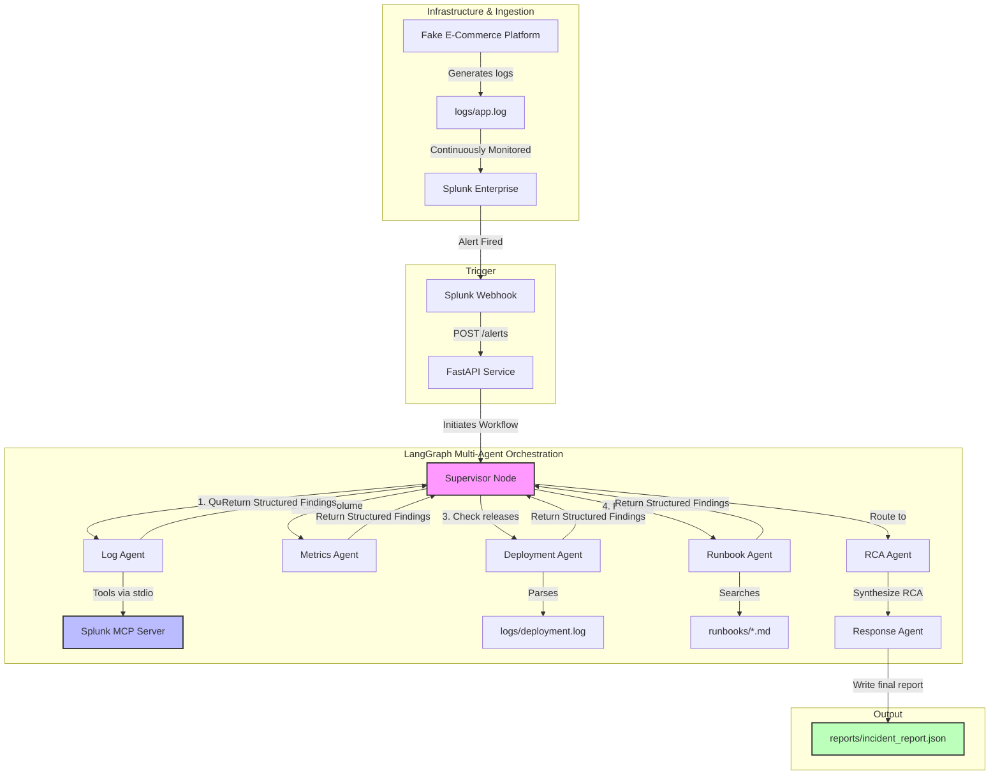

# OpsPilot AI — Autonomous Incident Investigation & Response Platform

OpsPilot AI is an agentic observability platform that automates incident triage and root cause analysis (RCA). When an operational alert is detected, OpsPilot triggers a collaborative team of specialized AI agents built on **LangGraph** and **FastAPI** to investigate application logs, infrastructure metrics, deployment events, and historical runbooks—correlating findings in real time.

OpsPilot AI natively integrates with the **Splunk MCP (Model Context Protocol) Server** to securely query Splunk Enterprise using standardized AI tools instead of direct REST API calls.

---

## Architecture Diagram



---

## Directory Structure

```text
SplunkAgenticOps/
├── .venv/                      # Python virtual environment (managed by uv)
├── .env                        # Local environment credentials & keys
├── pyproject.toml              # Project dependencies & python metadata
├── main.py                     # Main package runner
├── verify_opspilot.py          # E2E pipeline verification script
├── runbooks/                   # Local Operations Knowledge base
│   ├── __init__.py
│   ├── runbook_db.py           # Local runbook search engine
│   ├── database_errors.md      # DB troubleshooting runbook
│   ├── redis_errors.md         # Redis cache runbook
│   └── payment_errors.md       # Payment gateway runbook
├── api/                        # FastAPI Web API layer
│   ├── __init__.py
│   ├── main.py                 # FastAPI service endpoints
│   └── mcp_client.py           # Reusable Splunk MCP stdio wrapper
├── agents/                     # LangGraph Multi-Agent Orchestrator
│   ├── __init__.py
│   ├── state.py                # Graph state definitions
│   ├── models.py               # Pydantic structured output schemas
│   ├── nodes.py                # Individual Agent logic (Gemini)
│   └── graph.py                # Supervisor routing & state graph compilation
├── logs/
│   ├── app.log                 # Continuously ingested logs
│   └── deployment.log          # Correlated deployment events
└── reports/
    └── incident_report.json    # Final synthesized incident analysis
```

---

## Setup & Execution

Always run commands in the project's virtual environment using `uv`.

### 1. Environment Setup

Configure your `.env` file in the root directory:
```ini
MCP_Encrypted_Token=<Your Splunk MCP Encrypted Token>
GEMINI_API_KEY=<Your Gemini Developer API Key>
SPLUNK_USER=kshitijk146@gmail.com
SPLUNK_PASSWORD=Kshitijk@2003
```

### 2. Verify the E2E Flow

Run the automated verification script to run the multi-agent investigation workflow end-to-end:
```bash
uv run python verify_opspilot.py
```
This script will:
1. Verify connectivity to the Splunk MCP Server.
2. Query error logs from index `opspilot_logs`.
3. Orchestrate the Log, Metrics, Deployment, and Runbook agents.
4. Output a compiled Root Cause Analysis and remediation plan.
5. Create the incident report at `reports/incident_report.json`.

### 3. Start the FastAPI API Service

Start the web server to listen for webhooks and manual requests:
```bash
uv run uvicorn api.main:app --host 127.0.0.1 --port 8020 --reload
```

* **GET /health**: Check API status and Splunk connectivity.
* **POST /investigate**: Triggers an investigation with parameters:
  ```json
  {
    "alert_name": "E-Commerce Database Outage",
    "index": "opspilot_logs",
    "error_query": "search index=opspilot_logs ERROR",
    "earliest_time": "-24h",
    "latest_time": "now"
  }
  ```
* **POST /alerts**: Receives Splunk Alert webhooks and runs investigations in the background.
