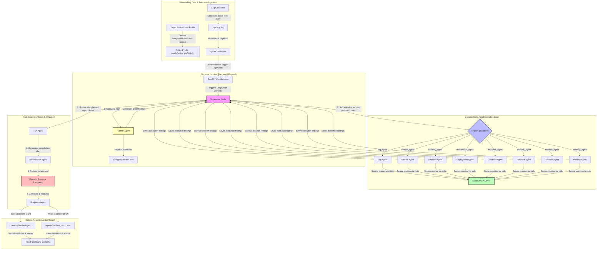

# OpsPilot AI — Architecture Diagram

This document illustrates the design and multi-agent layout of **OpsPilot AI** (Phase 5: Adaptive Investigation Engine).

```mermaid
graph TD
    subgraph Observability Data & Telemetry Ingestion
        A[Target Environment Profile] -->|Defines components/business context| B[Active Profile: config/active_profile.json]
        C[Log Generator] -->|Generates active error flows| D[logs/app.log]
        D -->|Monitored & Ingested| E[Splunk Enterprise]
    end

    subgraph Dynamic Incident Planning & Dispatch
        E -->|Alert Webhook Trigger /api/alerts| F[FastAPI Web Gateway]
        F -->|Triggers LangGraph Workflow| G[Supervisor Node]
        
        G -->|1. Formulate Plan| H[Planner Agent]
        H -->|Reads Capabilities| I[config/capabilities.json]
        H -->|Generates State findings| G
    end

    subgraph Dynamic Multi-Agent Execution Loop
        G -->|2. Sequentially executes planned chains| J{Registry dispatcher}
        J -->|log_agent| K[Log Agent]
        J -->|metrics_agent| L[Metrics Agent]
        J -->|anomaly_agent| M[Anomaly Agent]
        J -->|deployment_agent| N[Deployment Agent]
        J -->|database_agent| O[Database Agent]
        J -->|runbook_agent| P[Runbook Agent]
        J -->|timeline_agent| Q[Timeline Agent]
        J -->|memory_agent| R[Memory Agent]
        
        K & L & M & N & O & P & Q & R -->|Secure queries via stdio| S[Splunk MCP Server]
        K & L & M & N & O & P & Q & R -->|Saves execution findings| G
    end

    subgraph Root Cause Synthesis & Mitigation
        G -->|3. Routes after planned agents finish| T[RCA Agent]
        T -->|4. Generates remediation plan| U[Remediation Agent]
        U -->|5. Pauses for approval| V[Operator Approval Breakpoint]
        V -->|6. Approved & executed| W[Response Agent]
    end

    subgraph Outage Reporting & Dashboard
        W -->|Writes telemetry JSON| X[reports/incident_report.json]
        W -->|Saves outcome to DB| Y[memory/incidents.json]
        Y & X -->|Visualizes details & stream| Z[React Command Center UI]
    end

    style G fill:#f9f,stroke:#333,stroke-width:2px
    style H fill:#ffb,stroke:#333,stroke-width:2px
    style J fill:#bbf,stroke:#333,stroke-width:2px
    style S fill:#bfb,stroke:#333,stroke-width:2px
    style V fill:#fbb,stroke:#333,stroke-width:2px
```
